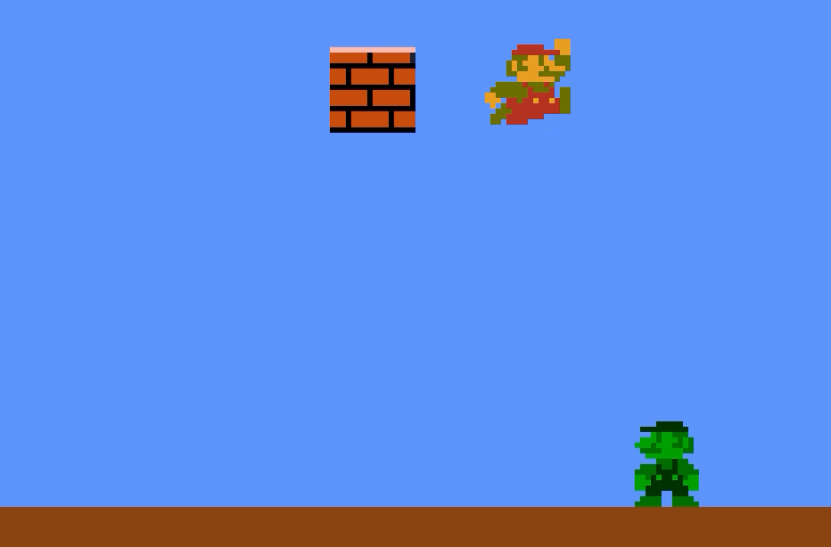

# bloop

**Rewind game sessions and edit code live.**

[Why Bloop?](./docs/why.md) | [Docs](https://trybloop.gg/docs) | [Demos](https://trybloop.gg)



## Quickstart

bloop has 0 dependencies. Experiment with it in 30 seconds.

```bash
bun create bloop@latest
```

## Features

- Unit testable
- Record gameplay "tapes"
- Rewind any live or recorded gameplay session
- Hot reload code changes during a rewinded play session
- Rollback netcode

## Hello World

```ts
import { Bloop } from "@bloopjs/bloop";

export const game = Bloop.create({
  // bag is a singleton object for global game state - useful for prototyping
  bag: {
    clicks: 0,
  }
})

// game systems run in the order you define them
game.system('input', {
  // systems update state in response to events:
  // * input events like keydown, mousemove
  // * frame lifecycle events like update
  // * network events like peer join
  mousedown({event, bag}) {
    bag.clicks++;
    console.log(`Clicked ${bag.clicks} times!`)
  },
})
```

This is a simple clicker game.

See the [docs](https://trybloop.gg/docs) for more info about how the game can be wired up to a renderer, headless testing, or how you can easily add rollback netcode.

## Built with Bloop

https://trybloop.gg has examples of game demos I've built with bloop, you can play them live in the browser or check out their [source code](./games/).

If you're interested in evaluating bloop for a game jam or for your commercial project, please hit me up! I'm happy to devote some of my time to help you get started.

Contributions welcome!

## Contributing

To get started developing bloop locally:

**Mac/Linux**

```bash
./bin/setup
```

**Windows (Powershell)**

```powershell
.\bin\setup.ps1
```

## Roadmap

### Q1 2026

#### Game Logic - Q1 2026

- [x] Keyboard and Mouse Input Handling
- [ ] Animated Sprites
- [ ] Transform Hierarchy
- [ ] Collision detection
- [ ] Cameras
- [ ] ECS
- [ ] Scene Loading
- [ ] Gameplay phases
- [ ] Feature flags
- [ ] Config values
- [ ] Gamepad (aka controller) input handling

#### Rendering Adapters - Q1 2026

- [ ] Godot
- [ ] [Toodle](https://toodle.gg)

#### Platform Targets

- [x] Browser
- [ ] PC
- [ ] Desktop Mac
- [ ] iOS
- [ ] Steam Deck
- [ ] Nintendo Switch
- [ ] Run anywhere you can allocate a byte buffer

### Performance

- [ ] Single frame object pools
- [ ] Multithreading

### Editing Integrations

- [ ] Aseprite
- [ ] LDtk
- [ ] VSCode / Cursor

--

This project was created using `bun init` in bun v1.3.1. [Bun](https://bun.com) is a fast all-in-one JavaScript runtime.
